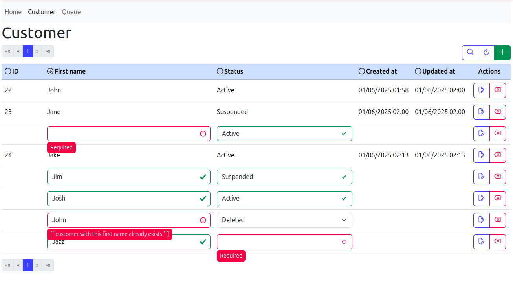

# vue-drf-interface
Vue 3 Interface to Django REST Framework
## About 
Simple single-page Vue front end application that reads specified REST endpoint and **automatically** provides tabular editable sortable interface to exposed endpoints.

front end and back end are independent of each other and communicate via CORs headers. Kept in the same repository for convenience

### Front End
The Vue 3 application does the following:

 - reads root endpoint and find all exposed endpoints
 - routs endpoints as pages in application
 - GETs particular endpoint and tabularizes the data based on OPTIONS
 - provides ability to add and edit objects based on OPTIONS 
 - validates data both client-side and server side
 - paginates the results
 - provides editing to 'choices' fields and foreign key search select fields
 - uses basic Bootstrap SCC and minimal external components

to install and run see corresponding [README](vue-front-end/README.md)

### Back End
Django Rest Framework with PostgreSQL :
 - Provides REST API

   - Minor modifications to out-of-the box framework
      - added 'page_size' to GET response for better pagination
      - added 'label' field to serializer to be able to select parent object in many-to-one relationship automatically
      - added capability for compounded sorting
     

 - So far only two serialized models
   - Customer
   - Queue (with foreign key to Customer)

 - If new model is added, properly serialized and exposed - front end will **automatically** add a new navigation link, and new model records can be added and edited

 - Django standard admin is enabled and usable
 - all authentication to endpoints is currently disabled

to install and run see corresponding [README](django-docker/README.md)

#### To Do
  
 - complex relationship field editing on the front end
   
   - ie. many-to-many, many-to-one and more complex relationship, file fields etc.
   - Token based authentication
   - roles & permissions
   - connection error handling
